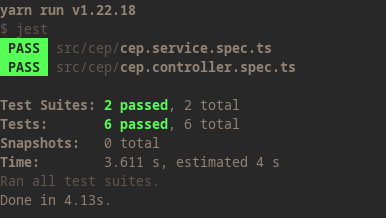
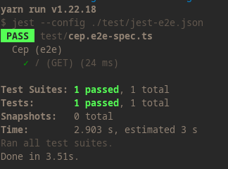

# Desafio Eureka - Backend

Esse é o Backend do Desafio proposto pela Eureka.

## Configurando o projeto

Para connfigurar o projeto, é necessário adicionar e connfigurar o `.env` ao 
mesmo. Para isso, depois de criar o `.env`, basta adicionar as seguintes 
informações:

```bash
DB_HOST=<url para o banco mysql desejado>
DB_PORT=<porta em que o serviço esta rodando(padrão 3306)>
DB_USER=<usuario selecionado>
DB_PASSWORD=<senha>
DB_NAME=<O database>
```

## Rodando o projeto

Primeiro, é necessário baixar todas as dependencias, estamos usando o 
`yarn` como package manager. Para instalar as dependencias com o `yarn` basta:

```bash
yarn
```

Depois de baixarmos todas as dependencias, para rodar o projeto no setup de
desenvolvimento, basta rodar:

```bash
yarn run start:dev
```

Caso queira rodar o projeto no setup de produção, primeiro iremos iniciar a build com:

```bash
yarn run build
```

E depois rodaremos:

```bash
yarn run start:prod
```

## Rodando os testes

Podemos rodar dois tipos de testes. Os testes unitários e os testes e2e ( end-to-end ). Para rodar os testes unitários, basta digitar o comando:

```bash
yarn test
```

Exemplo de resultado:



Já para os testes e2e, temos:

```bash
yarn test:e2e
```

Resultado esperado:

